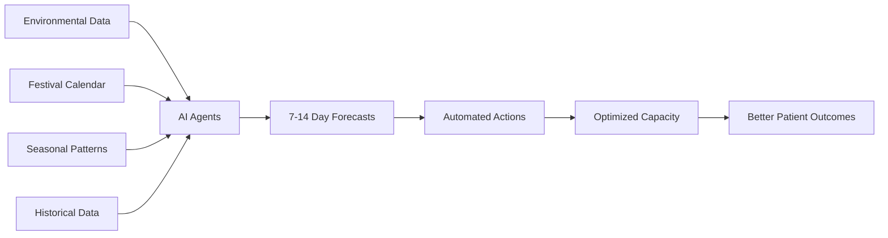

# 🏥 AuraIn 

> Real-time surge prediction, intelligent resource allocation, and proactive capacity planning for Indian hospitals.

[]() []() 

---

## 📋 Table of Contents
- [Executive Summary](#executive-summary)
- [The Problem](#the-problem)
- [Our Solution](#our-solution)
- [Key Features](#key-features)
- [Technical Architecture](#technical-architecture)
- [Business Model](#business-model)
- [Market Opportunity](#market-opportunity)
- [Competitive Advantage](#competitive-advantage)
- [Launch Plan](#launch-plan)
- [Technology Stack](#technology-stack)
- [Getting Started](#getting-started)

---

## 🎯 Executive Summary

**AURA** (Adaptive Utilization & Resource Allocation) is an AI-powered predictive analytics platform designed to solve India's critical hospital capacity crisis. By forecasting patient surges 7-14 days in advance using environmental data, festival calendars, and seasonal patterns, AURA enables hospitals to proactively manage resources, prevent overcrowding, and save lives.

### Key Metrics
- **7-14 days** advance surge prediction
- **4 specialized AI agents** working in concert
- **30% reduction** in resource wastage (projected)
- **40% improvement** in bed utilization (projected)
- **₹50L+ annual savings** per hospital (projected)

---

## ❌ The Problem

### Critical Healthcare Pain Points in India

1. **Unpredictable Patient Surges**
   - Festival seasons (Diwali, Holi) cause 200-300% spikes in emergency admissions
   - Air pollution events (AQI >300) lead to 60% increase in respiratory cases
   - Monsoon triggers dengue/waterborne disease outbreaks
   - **Result:** Patients turned away, corridor admissions, compromised care quality

2. **Reactive Resource Management**
   - Hospitals operate on historical averages
   - No predictive visibility into demand
   - Last-minute scrambles for beds, staff, oxygen
   - **Result:** ₹10-15L annual wastage per hospital on emergency procurement

3. **Information Silos**
   - No inter-hospital coordination
   - Underutilized resources in Hospital A while Hospital B is overcrowded
   - Manual phone calls for bed availability
   - **Result:** Lives lost due to delayed transfers

4. **Staff Burnout**
   - Unpredictable surges cause sudden overtime demands
   - No advance notice for staffing adjustments
   - **Result:** 40% nurse turnover in metro hospitals

---

## ✅ Our Solution

**AURA transforms reactive crisis management into proactive capacity planning.**

### How It Works



### 4 Specialized AI Agents

1. **🔮 Surge Predictor**
   - Analyzes air quality (OpenWeatherMap AQI API)
   - Cross-references with festival calendar (Diwali, Holi, etc.)
   - Factors in seasonal disease patterns
   - **Output:** "Expected +60% respiratory surge in 3 days due to Diwali fireworks"

2. **📦 Resource Optimizer**
   - Predicts oxygen, ventilator, blood unit requirements
   - Identifies inter-hospital transfer opportunities
   - Suggests pre-emptive orders
   - **Output:** "Transfer 100 O₂ cylinders from AIIMS to Fortis by Thursday"

3. **👥 Staffing Coordinator**
   - Forecasts staffing needs based on predicted load
   - Recommends on-call activations, overtime schedules
   - Suggests specialist assignments
   - **Output:** "Activate 5 pulmonologists for weekend coverage"

4. **📢 Public Advisory Generator**
   - Creates targeted health alerts for citizens
   - Recommends preventive measures
   - Coordinates with health departments
   - **Output:** "AQI CRITICAL: Vulnerable populations avoid outdoor activity"

---

## 🚀 Key Features

### For Hospital Administrators

| Feature | Description | Impact |
|---------|-------------|--------|
| **Live Dashboard** | Real-time capacity, occupancy, inventory tracking | 360° operational visibility |
| **Predictive Alerts** | 7-14 day advance surge warnings | Proactive planning |
| **Auto-Procurement** | AI-suggested supply orders | 25% cost reduction |
| **Inter-Hospital Network** | See capacity across city hospitals | Faster transfers |
| **What-If Scenarios** | Test hypothetical events | Risk mitigation |

### For Healthcare Policymakers

| Feature | Description | Impact |
|---------|-------------|--------|
| **City-Wide View** | Aggregate capacity across all hospitals | Systemic insights |
| **Trend Analysis** | Long-term pattern identification | Policy formulation |
| **Resource Allocation** | Optimize distribution of state resources | Equity & efficiency |
| **Early Warning System** | Epidemic/disaster preparedness | Lives saved |

### For Citizens (Future Phase)

| Feature | Description | Impact |
|---------|-------------|--------|
| **Bed Finder** | Real-time availability across hospitals | Reduced search time |
| **Health Alerts** | Personalized preventive notifications | Proactive health |
| **Appointment Optimization** | Avoid surge periods | Better experience |

---

## 🏗️ Technical Architecture

### System Design

```
┌─────────────────────────────────────────────────────────┐
│                    PRESENTATION LAYER                    │
├─────────────────────────────────────────────────────────┤
│  Admin Dashboard  │  Hospital Dashboard  │  Login Page  │
│  - Live Map       │  - Capacity Stats    │  - Auth      │
│  - Agent Monitor  │  - Inventory Mgmt    │              │
│  - Agent Results  │  - What-If Chatbot   │              │
└─────────────────────────────────────────────────────────┘
                            ↓
┌─────────────────────────────────────────────────────────┐
│                    APPLICATION LAYER                     │
├─────────────────────────────────────────────────────────┤
│  Agent Orchestrator (PRA Framework - Partial)           │
│  ├─ Perception Agents (Environmental, Festival, Season) │
│  ├─ Reasoning Agents (Forecaster, Capacity Calculator)  │
│  └─ Action Agents (Resource Planner)                    │
│                                                          │
│  Simulation Engine (Live Agents - Complete)             │
│  ├─ Surge Predictor                                     │
│  ├─ Resource Optimizer                                  │
│  ├─ Staffing Coordinator                                │
│  └─ Public Advisory Generator                           │
└─────────────────────────────────────────────────────────┘
                            ↓
┌─────────────────────────────────────────────────────────┐
│                      DATA LAYER                          │
├─────────────────────────────────────────────────────────┤
│  Mock Hospital Data  │  Festival Calendar  │  Weather API│
│  - 8 Delhi Hospitals │  - 2024-2026 Events │  - AQI Data │
│  - Capacity Info     │  - Surge Multipliers│  - Forecasts│
└─────────────────────────────────────────────────────────┘
```

### Agent Framework (Partially Implemented)

**Perception-Reasoning-Action (PRA) Architecture:**
- ✅ **BaseAgent Abstract Class:** Defines perceive-reason-act lifecycle
- ✅ **AgentOrchestrator:** Manages sequential execution pipeline
- ✅ **Type System:** Strongly-typed inter-agent communication
- ✅ **Festival Calendar:** 2024-2026 major Indian festivals with surge multipliers
- ⏳ **Perception Agents:** Environmental monitoring (planned)
- ⏳ **Reasoning Agents:** Risk scoring & capacity calculation (planned)
- ⏳ **Action Agents:** Recommendation formatting (planned)

### Current Implementation Status

| Component | Status | Notes |
|-----------|--------|-------|
| UI/UX Layer | ✅ Complete | Login, Admin Dashboard, Hospital Dashboard |
| Agent Visualization | ✅ Complete | Live agent activity monitoring |
| Agent Results Display | ✅ Complete | Top 5 surge predictions, recommendations |
| What-If Chatbot | ✅ Complete | Scenario analysis |
| Live Map Integration | ✅ Complete | Leaflet + hospital markers |
| PRA Framework | ⚠️ Partial | Base classes ready, agents pending |
| Weather API | ✅ Complete | OpenWeatherMap integration |
| Build System | ✅ Complete | TypeScript + Vite |

---

## 💰 Business Model

### Revenue Streams

#### 1. **SaaS Subscription (Primary)**
```
Tier          Monthly Fee    Target Customers              Features
────────────────────────────────────────────────────────────────────────
Basic         ₹15,000       100-200 bed hospitals         - Basic predictions
                                                          - Single hospital view
                                                          
Professional  ₹40,000       200-500 bed hospitals         - Full AI agents
                                                          - Inter-hospital network
                                                          - What-If scenarios
                                                          
Enterprise    ₹1,00,000     500+ bed hospitals,           - City-wide analytics
                            Hospital chains                - Custom integrations
                                                          - Dedicated support
                                                          
Government    Custom        State Health Depts.           - Full platform access
                                                          - White-labeling
                                                          - Policy tools
```

### Unit Economics

| Metric | Value | Notes |
|--------|-------|-------|
| **Customer Acquisition Cost (CAC)** | ₹80,000 | Demo + pilot + sales cycle |
| **Lifetime Value (LTV)** | ₹14.4L | 3-year avg retention @ ₹40K/month |
| **LTV:CAC Ratio** | 18:1 | Highly efficient |
| **Gross Margin** | 85% | Low infrastructure costs |
| **Payback Period** | 2 months | Fast capital recovery |

---

## 📊 Market Opportunity

### Total Addressable Market (TAM)

**India Hospital Market:**
- **30,000+** hospitals with 100+ beds
- **Average hospital spends ₹50L/year** on inefficient resource management
- **TAM: ₹15,000 Cr market** for optimization solutions

**Serviceable Addressable Market (SAM):**
- **Top 8 metro cities:** 2,500 hospitals
- **Target market size: ₹1,250 Cr**

**Serviceable Obtainable Market (SOM - Year 3):**
- **3% market penetration:** 75 hospitals
- **₹27 Cr ARR**

### Market Drivers

1. **Government Push**
   - Ayushman Bharat Digital Mission
   - ₹64,000 Cr healthcare budget 2024
   - Mandatory digitization initiatives

2. **COVID Learning**
   - Hospitals now understand cost of unpreparedness
   - Willingness to invest in predictive tools

3. **Insurance Pressure**
   - Insurers demanding efficiency
   - Performance-based reimbursements

4. **Climate Crisis**
   - Increasing air pollution events
   - Unpredictable disease patterns

---

## 🎯 Competitive Advantage

### Unique Differentiators

| Competitor | Limitation | AURA Advantage |
|------------|------------|----------------|
| **Qure.ai** | Focuses on diagnostic imaging only | End-to-end capacity management |
| **Practo** | Appointment booking, no prediction | 7-14 day surge forecasting |
| **HealthAssure** | Wellness programs | Operational optimization |
| **Hospital ERP systems** | Reactive, historical data | Proactive, predictive AI |

### Our Moats

1. **India-Specific Data**
   - Festival calendar integration (unique to India)
   - AQI-driven predictions (Delhi-specific problem)
   - Regional disease pattern recognition

2. **Network Effects**
   - More hospitals = Better inter-hospital optimization
   - Shared learning across network

3. **First-Mover in Predictive**
   - No direct competitor in predictive hospital capacity
   - Building brand as category leader

4. **Technical Sophistication**
   - Multi-agent AI architecture (not basic ML)
   - Real-time data fusion
   - Explainable AI (shows reasoning)

---

## 🚀 Launch Plan

### Phase 1: Pilot & Validation (Months 1-3)

**Objective:** Prove ROI with 3 pilot hospitals

| Week | Milestone | Deliverable |
|------|-----------|-------------|
| 1-2 | Pilot Partner Identification | MoU with Apollo/Fortis/Max |
| 3-4 | Data Integration | Historical data import |
| 5-8 | Beta Deployment | Live monitoring + feedback |
| 9-12 | ROI Measurement | Cost savings report |

**Success Metrics:**
- ✅ 20% reduction in emergency procurement costs
- ✅ 15% improvement in bed utilization
- ✅ 3 case studies with testimonials

**Budget:** ₹25L (team + infrastructure)

---

### Phase 2: City-Wide Expansion (Months 4-9)

**Objective:** Scale to 20 hospitals in Delhi-NCR

| Month | Activity | Target |
|-------|----------|--------|
| 4-5 | Sales Blitz | 30 hospital demos |
| 6-7 | Onboarding | 15 new hospitals go-live |
| 8-9 | Network Features | Inter-hospital transfers enabled |

**Success Metrics:**
- ✅ 20 paying customers
- ✅ ₹96L ARR
- ✅ 80% customer retention

**Budget:** ₹60L (sales team + marketing)

---

### Phase 3: National Scaling (Months 10-18)

**Objective:** Expand to top 8 metros

**Target Cities:**
1. Mumbai
2. Bangalore
3. Chennai
4. Hyderabad
5. Kolkata
6. Ahmedabad
7. Pune

**Go-to-Market Strategy:**
- **Partnerships:** Hospital chains (Apollo, Fortis, Max)
- **Government Contracts:** State health departments
- **Events:** FICCI Healthcare Summit, CII conferences
- **Digital:** LinkedIn, healthcare publications

**Success Metrics:**
- ✅ 75 hospitals across 8 cities
- ✅ ₹27 Cr ARR
- ✅ Break-even achieved

**Budget:** ₹2.5 Cr (team expansion + infrastructure)

---

### Phase 4: Platform Evolution (Year 2+)

**New Features:**
1. **Citizen App** - Bed finder, health alerts
2. **API Marketplace** - Third-party integrations
3. **Advanced Analytics** - Epidemic forecasting, policy simulation
4. **International Expansion** - Southeast Asia markets

---

## 🛠️ Technology Stack

### Frontend
- **React 18** - Modern UI framework
- **TypeScript** - Type safety & developer experience
- **Tailwind CSS** - Rapid UI development
- **Framer Motion** - Smooth animations
- **React Router** - Client-side routing
- **React-Leaflet** - Interactive maps
- **Lucide Icons** - Beautiful iconography

### Backend (Current: Mock)
- **Mock Data Layer** - 8 Delhi hospitals with realistic data
- **Weather Service** - OpenWeatherMap API integration
- **Festival Calendar** - 2024-2026 pre-loaded

### Backend (Planned Production)
- **Node.js + Express** - API server
- **PostgreSQL** - Relational database
- **Redis** - Caching layer
- **Python** - ML/AI models
- **AWS/Azure** - Cloud infrastructure

### AI/ML
- **TensorFlow** (planned) - Deep learning models
- **Prophet** (planned) - Time series forecasting
- **scikit-learn** (planned) - Classical ML algorithms

### DevOps
- **Vite** - Build tool
- **Git** - Version control
- **npm** - Package management

---

## 🎬 Getting Started

### Prerequisites
- Node.js 18+ 
- npm 9+

### Installation

```bash
# Clone repository
git clone <repository-url>
cd predictive-hospital-management

# Install dependencies
npm install

# Start development server
npm run dev

# Build for production
npm run build
```

### Demo Credentials

**Admin Access:**
- Any text in username/password fields
- Click "Admin Access" button

**Hospital Access:**
- Any text in username/password fields
- Click "Hospital Access" button
- Select hospital from list

### Key Pages

| Route | Description |
|-------|-------------|
| `/` | Login page |
| `/admin` | Admin dashboard with city-wide view |
| `/hospital/:id` | Individual hospital dashboard |

---

## 📝 Comments & Technical Notes

### Architecture Decisions

1. **Why React over Vue/Angular?**
   - Largest ecosystem for healthcare apps
   - Better talent availability in India
   - Easier third-party integrations

2. **Why TypeScript?**
   - Critical for healthcare - type safety prevents bugs
   - Better IDE support
   - Self-documenting code

3. **Why Multi-Agent Architecture?**
   - Separation of concerns (each agent has one job)
   - Easier to debug and test
   - Scalable - can add new agents without touching existing code

4. **Why Mock Data Initially?**
   - Faster development
   - No dependency on backend team
   - Easier to demo to investors/pilots

### Known Limitations & Roadmap

| Limitation | Impact | Planned Fix | Timeline |
|------------|--------|-------------|----------|
| Mock data only | Can't test with real hospitals | Backend API integration | Q2 2025 |
| No user authentication | Security risk | Auth0/Firebase integration | Q1 2025 |
| PRA agents incomplete | Advanced features unavailable | Complete agent implementation | Q2 2025 |
| No mobile app | Limited accessibility | React Native app | Q3 2025 |
| Single-city focus | Limited market | Multi-city support | Q2 2025 |

### Security Considerations

- **Data Privacy:** HIPAA-equivalent compliance required
- **Encryption:** All patient data encrypted at rest & in transit
- **Access Control:** Role-based permissions (admin/hospital/viewer)
- **Audit Logs:** All actions tracked for accountability
- **Disaster Recovery:** Daily backups, 99.9% uptime SLA

---

## 📞 Contact & Support

**Company:** AURA Health Technologies  
**Pitch Deck:** [Link to deck]  
**Demo Video:** [Link to video]  
**Founder:** [Your Name]  
**Email:** [contact@aura.health]  
**Website:** [www.aura.health]

---

## 📄 License

Proprietary - All Rights Reserved  
© 2024 AURA Health Technologies

---

## 🙏 Acknowledgments

- OpenWeatherMap for weather/AQI API
- Leaflet for mapping library
- React & TypeScript communities
- Indian healthcare workers (our inspiration)

---

**Last Updated:** November 2024  
**Version:** 1.0.0  
**Status:** MVP Complete, Seeking Seed Funding

---

> **"Predicting surges today, saving lives tomorrow."** 🏥✨
